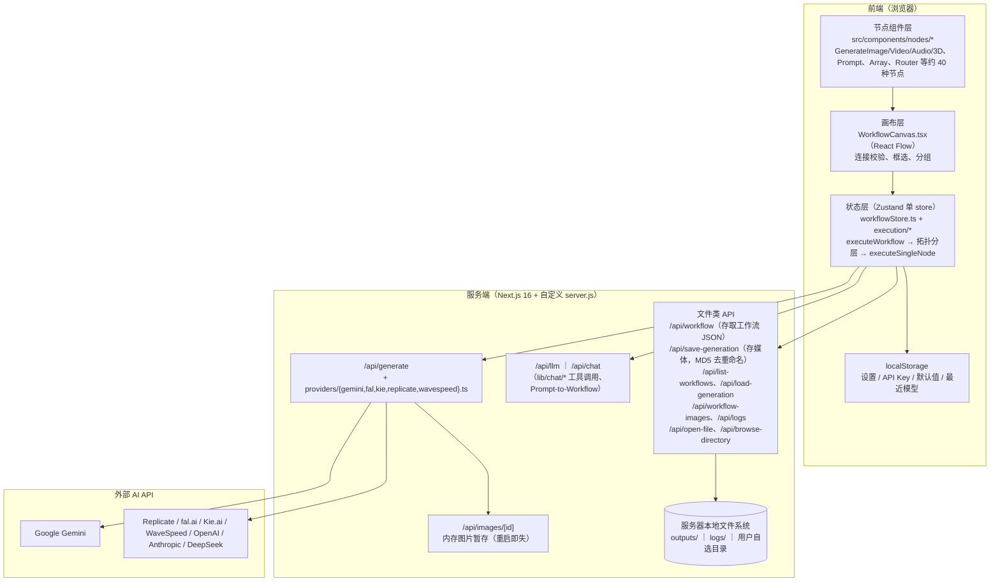
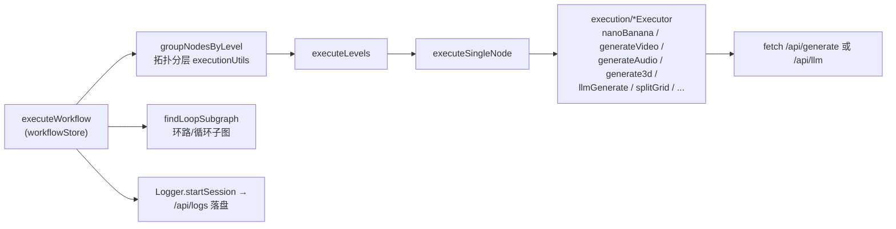
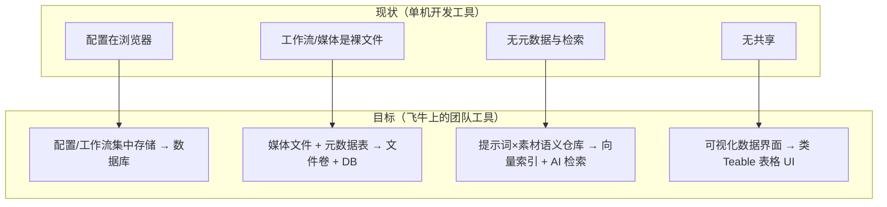

# node-banana 代码图谱与架构分析

> 调研日期：2026-08-05 ｜ 工具：codebase-memory-mcp（moderate 模式索引）+ 源码抽查验证
> 项目：node-banana v1.6.0（/Users/wuzhu/orca/node-banana）
> 目的：为「部署到飞牛 NAS 并做持久化运行」提供架构事实依据

---

## 1. 项目是什么

node-banana 是一个开源（MIT）的**节点式 AI 工作流可视化编辑器**（对标/复刻 Weavy，即 Figma Weave 的产品形态，见 `docs/weavy-research/`）。用户在 React Flow 画布上拖节点、连边，按依赖顺序调用各家 AI API，生成图像、视频、3D、音频。BYOK（自带 API Key）、本地优先、无账号体系。

## 2. 图谱统计（codebase-memory-mcp 索引结果）

| 指标 | 数量 |
|---|---|
| 节点总数 | 2188 |
| 边总数 | 6200 |
| Function | 904 |
| Variable | 335 |
| Interface | 249 |
| File / Module | 227 / 227 |
| Type / Class / Method | 80 / 4 / 19 |
| Route（HTTP 路由节点） | 4 |
| 关键边类型 | DEFINES 1904 ｜ CALLS 1487 ｜ IMPORTS 1155 ｜ USAGE 920 ｜ FILE_CHANGES_WITH 213 ｜ HTTP_CALLS 8 ｜ WRITES 34 |

解读：典型的「前端重、服务端薄」结构——904 个函数里绝大多数在组件与 store 层；服务端只有一组 Next.js Route Handler，且无任何数据库依赖（无 Prisma/ORM/SQL）。

## 3. 分层架构

## 4. 执行流（图谱 trace_path 验证）

`executeWorkflow` 的调用链（outbound depth=2）：

要点：

- 按层并行执行，层内再按 batch 分块（`chunk`）；支持 Loop 子图与 skip 传播。
- 媒体在**客户端**以 base64/blob 流转，需要给外部 provider 一个 URL 时才经 `/api/images/[id]` 内存暂存。
- 成本核算在 `utils/costCalculator.ts`，成本数据也存 localStorage。

## 5. 持久化现状清单（本次调研的核心事实）

| 数据 | 现状位置 | 方式 | 问题（对 NAS 团队共用而言） |
|---|---|---|---|
| 应用设置、API Key、节点默认值、最近模型、FTUX 状态 | 浏览器 localStorage（`store/utils/localStorage.ts`，约 10 个 key） | 纯前端 | **绑定浏览器**，换台电脑/浏览器全丢；5 人无法共享配置 |
| 工作流定义（节点+边 JSON） | 服务器文件系统，`/api/workflow` 存到**用户自选的任意绝对路径**（pathValidation 仅做穿越/系统目录防护） | 手写 JSON 文件 | 文件散落各处；无索引、无标签、无搜索 |
| 生成的媒体（图/视频/音频/3D） | 服务器文件系统，`/api/save-generation` 写入指定目录，文件名带 MD5 去重后缀 | 手写文件 | 只有文件，**无元数据**（提示词、模型、参数、成本散落在 workflow JSON 里） |
| 生成历史面板（GlobalImageHistory） | 依赖上述文件 + 会话状态 | — | 无法跨设备、跨人检索「谁用什么提示词生成了什么」 |
| 运行日志 | `logs/` 目录（logger-server.ts，定期轮转） | JSON 会话文件 | 仅调试用 |
| 图片 URL 暂存 | 内存 Map（`lib/images/store.ts`） | 进程内存 | 重启即失（设计如此，可接受） |
| 数据库 | **完全没有** | — | 这正是本次选型要补的层 |

## 6. 部署相关事实（影响飞牛落地）

1. **自定义 server.js**：`hostname` 硬编码为 `localhost`——在 NAS 上容器化后**必须改成 `0.0.0.0`**，否则局域网访问不到。端口 `PORT` 环境变量可调（默认 3000）。请求超时放宽到 10 分钟（为长视频生成）。
2. **Next.js 16 + Node 18+**，`serverActions.bodySizeLimit: 100mb`，构建产物可用 standalone 模式进一步缩小镜像。
3. **无外部服务依赖**：不连任何数据库，唯一强依赖是外网 AI API（Gemini 必需，其余可选）——非常适合 NAS 离线内网部署。
4. **文件写入路径**：目前让用户填绝对路径。容器化后应固定挂载一个卷（如 `/data`），把 `outputs/`、`logs/`、工作流目录全部指向卷内。
5. **无鉴权**：应用本身没有任何登录/权限，5 人以内内网共用符合现状，不需要额外改造（如需公网暴露则另说）。
6. **多语言**：已有 zh/en i18n，对中文团队友好。

## 7. 结论：NAS 化需要补的四块拼图

这四块拼图对应的候选技术，见 `02-数据库与AI存储调研.md`；逐项对比与推荐路线见 `03-选型评估与飞牛落地建议.md`。
