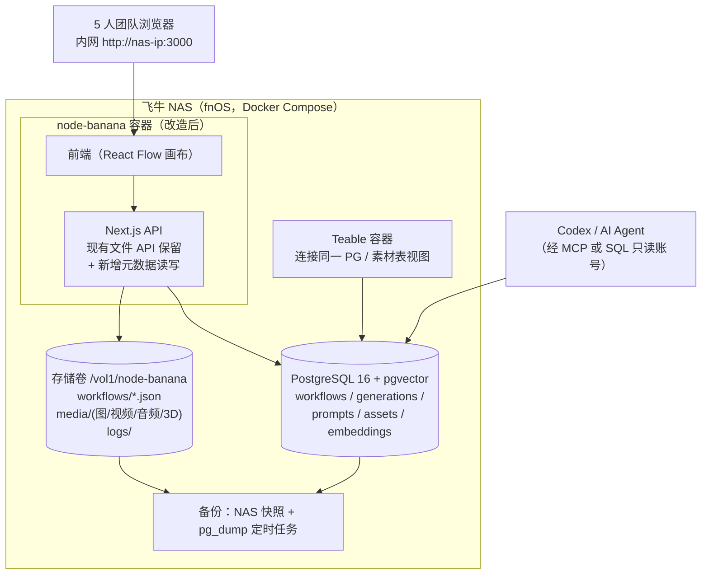
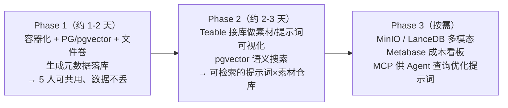

# 选型评估与飞牛 NAS 落地建议

> 调研日期：2026-08-05 ｜ 依据：`01-代码图谱与架构分析.md`（架构事实）+ `02-数据库与AI存储调研.md`（市场事实）
> 目标环境：飞牛 NAS（fnOS，Docker 部署）｜ 使用方：吴越 AI 自媒体团队（≤5 人，内网共用，无需账号体系）

> **2026-08-05 修订**：完成 NAS 实机盘点后（见 `04-飞牛NAS现状盘点与复用评估.md`），本方案从「全新建」修订为「复用优先」——
> NAS 已有 **ParadeDB PG17（pgvector + pg_search + pg_trgm）、MinIO、Neo4j、完整 WeKnora 知识库栈**。
> 核心结论修订为：**不新起任何数据库进程**，在现有 ParadeDB 实例新建 `nodebanana` 库，
> 用 WeKnora 知识库承担「AI 化语义层」，新增容器仅 node-banana 本身（Teable/NocoDB 降级为可选项）。
> 以下「全新建」版本的架构与路线保留作对照，复用版架构与路线以 04 文档第 5-6 节为准。

---

## 1. 评估维度与权重（按本项目需求定制）

| 维度 | 权重 | 说明 |
|---|---|---|
| 部署/运维成本 | ★★★ | NAS 上容器越少越好，单人可维护 |
| 数据模型适配 | ★★★ | 工作流 JSON + 生成元数据 + 媒体路径 + 提示词版本 |
| AI 化能力 | ★★★ | 向量检索、MCP/Agent 可读写、提示词语义仓库 |
| 可视化（非技术人员可用） | ★★☆ | 表格/画廊浏览素材与数据 |
| 与 node-banana 集成成本 | ★★★ | 项目目前零数据库，任何方案都要写代码，评估改动面 |
| 备份/迁移 | ★★☆ | NAS 快照/pg_dump/文件同步 |
| 生态与趋势 | ★☆☆ | 2026 社区活跃度、中文资料 |

## 2. 总评对比表（5 分制）

| 方案 | 运维 | 模型适配 | AI 化 | 可视化 | 集成成本 | 备份 | 总评 |
|---|---|---|---|---|---|---|---|
| **PG 16 + pgvector + 文件卷** | 4 | 5 | 4 | 1* | 3 | 4 | **4.0 推荐作底座** |
| PG + pgvector + MinIO | 3 | 5 | 4 | 1* | 3 | 3 | 3.7 媒体量大后升级 |
| **Teable（Database Table Beta 挂载已有表）** | 3 | 4 | 4 | 5 | 2 | 3 | **3.7 界面层首选（需实测 Beta 成熟度）** |
| NocoDB | 4 | 3 | 3 | 5 | 2 | 3 | 3.4 轻量备选 |
| PocketBase | 5 | 3 | 2 | 4 | 3 | 5 | 3.4 极简路线备选 |
| SQLite + Litestream | 5 | 3 | 3 | 1 | 3 | 5 | 3.3 零运维但天花板低 |
| LanceDB（第二阶段） | 4 | 4 | 5 | 1 | 3 | 4 | 3.6 多模态语义库增强 |
| Directus | 3 | 4 | 2 | 4 | 2 | 3 | 3.1 备选 |
| Supabase 自托管 | 2 | 5 | 4 | 2 | 2 | 3 | 3.0 偏重 |
| Qdrant | 3 | 3 | 4 | 1 | 2 | 3 | 2.7 pgvector 已够 |

*「可视化」低分是因为纯数据库不带业务 UI——这正是要和 Teable/NocoDB 组合使用的原因。*

## 3. 关键判断

1. **底座收敛到 PostgreSQL + pgvector**：一个容器同时承载元数据、JSONB（工作流定义直接进库）、全文检索、向量检索。Teable、NocoDB、Directus、Metabase、LanceDB 生态全都围绕 PG，之后换界面层不动底座。
2. **媒体继续走文件（现状架构即最佳实践）**：node-banana 现有的「写文件 + MD5 去重」只需固定到挂载卷，DB 里存相对路径 + 元数据。MinIO 等媒体量/多端访问需求出现后再加。
3. **Teable 作界面层贴合你点名的趋势**：表格/画廊视图 + 外部 PG + S3 存储都满足「给非技术人员一个可视化数据窗口」。但要清醒：官方部署文档明确 **AI Agent / AI 自动化属 Enterprise 许可**，自部署社区版拿到的是「专业表格数据库 + API」，AI 对话能力要么付费授权、要么用云版、要么我们自己经 MCP + 外部模型实现（Phase 2 先实测再定）。若只取「可视化表格」价值，NocoDB（更轻、AI 依赖少）是同档备选。
4. **"AI 化"分两档**：第一档 pgvector + PG 全文检索已够 5 人团队；第二档（素材量上万、要按图搜图/按视频搜视频）再引入 LanceDB 专管多模态 embedding。
5. **不建议**：为 5 人内网工具上 Milvus/Supabase 全家桶/K8s——运维成本远超收益；也不建议把工作流 JSON 只存表格行里而丢掉文件——文件仍是跨工具（git、编辑器、其他 AI 工具）流通的最好格式，**库做索引、文件做载体**。

## 4. 推荐目标架构

数据流：**文件是媒体与 workflow 的载体，PG 是索引与知识层，Teable 是给人看的窗口，MCP/SQL 是给 Agent 用的窗口。**

## 5. node-banana 改造点清单（来自代码事实）

| # | 改造 | 位置 | 工作量 |
|---|---|---|---|
| 1 | server.js `hostname: localhost → 0.0.0.0`，编写 Dockerfile + compose | server.js | 小 |
| 2 | 挂载卷统一数据根（如 `/data`），outputs/logs/工作流默认目录指向卷 | 环境变量 + pathValidation 白名单 | 小 |
| 3 | 新增 PG 访问层（pg 或 Drizzle/Prisma 任选）与建表迁移 | 新增 `src/lib/db/` | 中 |
| 4 | `/api/save-generation` 成功写文件后，同步写入 `generations` 表（提示词、模型、参数、成本、文件路径、内容哈希） | save-generation/route.ts | 中 |
| 5 | `/api/workflow` 保存时同步 `workflows` 表（名称、JSONB、标签、版本） | workflow/route.ts + versionHistory | 中 |
| 6 | localStorage 中的团队共享配置（API Key、节点默认值）改为服务端配置接口（个人偏好仍留 localStorage） | store/utils/localStorage.ts + 新 API | 中 |
| 7 | 提示词/生成记录 embedding 写入 pgvector（调 Gemini embedding，生成时异步触发） | 新增 `src/lib/embed/` | 中 |
| 8 | Teable/Metabase 连库视图；开放只读 SQL/MCP 给 Agent | 运维配置 | 小 |

说明：任何方案都要做 1-4；5-8 按阶段推进。不存在「零改代码直接接上」的数据库——项目目前连 ORM 都没有，这是所有候选方案的共同起点。

## 6. 分阶段路线建议

## 7. 风险与注意

- **Teable AI 能力实测（已核实许可分级）**：自部署社区版不含 AI Agent/AI 自动化（Enterprise 许可功能），落地 Phase 2 前先起容器实测实际可用功能，若 AI 部分受限，则 Teable 只做可视化层，AI 对话查询经 pgvector + MCP 自建；
- **API Key 集中保管**：Key 从浏览器搬到服务端后，等于全团队共用一组 Key，成本归属要用 `generations` 表记录区分（可在 workflow/节点层面加「使用人」字段，无需真账号）；
- **外网依赖不变**：生成仍走 Gemini/fal 等外网 API，NAS 只解决存储与协作，网络代理需在 fnOS 容器层配置；
- **备份边界**：PG 用 pg_dump 每日导出到卷 + 飞牛快照；媒体卷本身用飞牛自带快照/rsync，双保险；
- **许可**：Teable/NocoDB 为 AGPL，团队内部自用无问题；若未来对外提供服务需再评估。

## 8. 一句话结论

**（修订版，以本条为准）复用 NAS 已有的 ParadeDB 实例建 `nodebanana` 库、复用 WeKnora 做 AI 语义层、媒体先走文件卷（MinIO 已在跑，随时可切），新增容器只有 node-banana 自己**——运维增量最小，且 BM25+向量+图谱的 AI 化能力比原「全新建」方案更强。Teable/NocoDB 留作可选的表格界面层。

~~（原始版）**底座 PostgreSQL + pgvector、媒体走文件卷、界面用 Teable、第二阶段再加 LanceDB/MinIO/Metabase**~~
