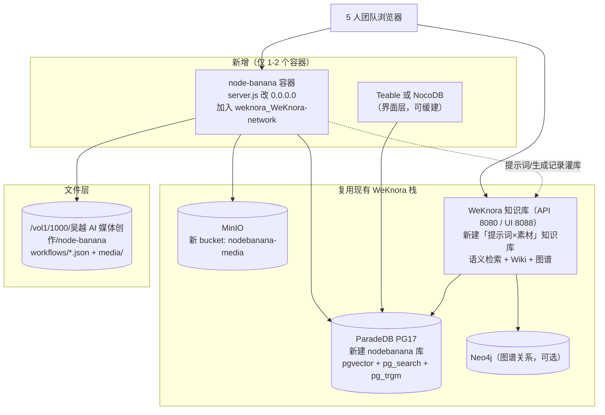

# 飞牛 NAS 现状盘点与复用评估

> 调研日期：2026-08-05 ｜ 方式：SSH 实测（Tailscale `100.112.104.77`，局域网 IP `192.168.1.161` 当前不可达）
> 主机：FN-EVO4-8CAD（fnOS）｜ 凭据：`wyai@` + `~/.ssh/fnos_nas_key`
> 性质：本文件全部内容来自实机命令输出，非推测

---

## 1. 硬件与资源余量

| 项 | 实测值 | 对新增服务的含义 |
|---|---|---|
| CPU | 4 核 | node-banana（Next.js）+ 1 个表格 UI 容器没问题 |
| 内存 | 15Gi 总量，已用 7.8Gi，可用约 7.6Gi（Swap 8Gi 已用 1.4Gi） | 有余量但不宽裕，**能复用就不新起数据库** |
| 磁盘 | /vol1 共 3.7T，已用 490G，可用 3.2T | 媒体存储完全不是瓶颈 |
| Docker Root | `/vol1/docker` | 容器数据已在存储池上 |

## 2. 容器清单（docker ps 实测，按栈分组）

### 2.1 WeKnora 知识库栈（compose：`/home/wyai/weknora/docker-compose.yml`，7 容器，全部运行中）

| 容器 | 镜像 | 端口 | 对本项目的价值 |
|---|---|---|---|
| WeKnora-app / frontend / docreader | wechatopenai/weknora-*:latest | 8080（API）、8088（UI） | **现成的 AI 知识库**：向量+关键词+图谱检索，已有实战语料（WorkBuddy 234 条知识、Wiki 46 页/308 链接已验证） |
| **WeKnora-postgres** | **paradedb/paradedb:v0.22.2-pg17** | 仅容器网络 | **这就是我们要找的数据库**：PG 17 + pgvector 0.8.1 + pg_search 0.22.2（BM25）+ pg_trgm + pgcrypto 全部可用（已实测 `pg_available_extensions`） |
| WeKnora-neo4j | neo4j:2025.10.1 | 7474 / 7687 已映射 | 图谱关系（提示词↔素材↔选题）可选 |
| **WeKnora-minio** | minio RELEASE.2025-09-07 | 9000/9001 已映射 | **现成的 S3 对象存储**，WeKnora 已配置 bucket `wyai` |
| WeKnora-redis | redis:7.0-alpine | 仅容器网络 | 缓存可选 |

实测补充：`weknora` 角色是 **superuser + createdb**（已查 `pg_roles`），可以直接在同一实例里 `CREATE DATABASE nodebanana` 并装扩展；WeKnora 自身库已有 5.6GB 数据。

### 2.2 选题/RSS 信号栈（`/root/folo-feed-stack`，6 容器）

topic-freshrss（8180）、topic-rsshub（1200）、topic-xhs-rss（1300，unhealthy）、topic-we-mp-rss（8101）、topic-web-monitor-rss（unhealthy）、topic-redis。与本项目无直接耦合，但说明团队内容素材管线已经在 NAS 上。

### 2.3 视频工具栈（`/vol1/1000/video-tools`，6 容器）

video-downloader（5000）、streamcap（8001）、pot-server（4416）、douyin-api（8000）、cobalt（9200）、parse-video-py（8002）——下载/解析能力已在本地，未来「素材入库」可以直接对接。

### 2.4 其他

| 容器 | 说明 |
|---|---|
| openconnector（3100） | OOMOL API 连接管理（之前修过 healthcheck，healthy） |
| navi-proxy（7200） | Node 22 API 网关（providers.json），可能是出网/API 路由层 |
| orca-server（6768）、craft-agents、openfang、aiutu-gateway（7243）、wigolo（3334） | 各自的 agent/网关服务 |

### 2.5 网络

已有 `weknora_WeKnora-network`、`topic-signal-feeds`、`video-tools-network` 等独立网络。新服务接入 WeKnora 的 PG/MinIO 最干净的方式是加入 `weknora_WeKnora-network`。

另注：`/vol1/1000/吴越 AI 媒体创作/` 下有 sing-box-docker（代理客户端）——外部 AI API（Gemini 等）的出网路径在 NAS 上已有先例。

---

## 3. 可复用性评估（对原方案的影响）

| 原方案组件 | NAS 现状 | 结论 |
|---|---|---|
| PostgreSQL 16 + pgvector 新容器 | ParadeDB PG17 + pgvector 0.8.1 + pg_search 已在跑，superuser 可建新库 | **不新起 PG**，直接 `CREATE DATABASE nodebanana`；BM25+向量+trigram 比原方案还强 |
| MinIO（Phase 3 才考虑） | 已在跑，9000/9001 已映射 | **提前可用**，媒体对象存储随时可加 bucket |
| Teable/NocoDB 界面层 | NAS 上无表格 UI | 仍需新增。注意：Teable 挂载已有 PG 表靠 Database Table（Beta 功能，需实测）；成熟替代为 NocoDB 连外部 PG 数据源或 Directus |
| WeKnora（原计划外） | 完整知识库 + API + UI（8088） | **意外收获**：提示词库/研究文档/生成记录可灌入独立知识库，直接获得语义检索+Wiki+图谱，等于"AI 化数据库"的一层已经存在 |
| Neo4j（原计划外） | 已随 WeKnora 运行 | 图谱关系第二阶段可复用，不必自建 |
| Redis | 已有两个实例 | 需要时复用 |
| 出网代理 | sing-box / navi-proxy 已有先例 | node-banana 容器调 Gemini/fal 的出网可照此配置 |

## 4. 复用的风险与边界（必须说清楚）

1. **共享 ParadeDB 实例的耦合**：该实例归 WeKnora compose 管理，WeKnora 升级换镜像时 node-banana 的库会被带着走。缓解：node-banana 只用标准 PG 能力 + pgvector/pg_search，schema 自包含、每日 pg_dump 独立备份；若未来负载冲突再拆出独立容器（数据可平滑 pg_restore）。
2. **资源争抢**：PG 已承载 5.6GB WeKnora 库；node-banana 的元数据量级（万级行）对它微不足道，但 embedding 批量写入要避开 WeKnora 重建索引的窗口。
3. **网络归属**：node-banana 容器加入 `weknora_WeKnora-network` 后，PG/MinIO/Neo4j 都用容器名直连，不必把 5432 映射到宿主机（保持现状，更安全）。
4. **MinIO 凭据（已解决，2026-08-05）**：root 凭据在容器环境变量 `MINIO_ROOT_USER/PASSWORD` 中（.env 的 ACCESS_KEY 并非 root，故早前 `mc ls` 被拒）；root 登录验证成功，现有 bucket 仅 `wyai`（空）。接入时另建独立 bucket（如 `nodebanana-media`）+ 独立 access key，不碰 `wyai`。
5. **WeKnora API 需鉴权**（`/api/v1/system/info` 返回 401）：node-banana 对接时需先建租户/拿 API key，这一步在 Phase 2 做。

## 5. 修订后的复用架构（替代 03 文档的「全新建」架构）

三层分工：**ParadeDB 管结构化元数据（含向量），MinIO/文件卷管媒体本体，WeKnora 管「AI 化」语义知识层**。Teable/NocoDB 从必选项降级为「锦上添花的表格视图」——因为 WeKnora UI 已经能覆盖一部分浏览/检索需求。

## 6. 修订后的分阶段路线

| 阶段 | 内容 | 新增容器 |
|---|---|---|
| Phase 1（1-2 天） | node-banana 容器化（hostname 改 0.0.0.0、挂卷）；在 ParadeDB 建 `nodebanana` 库 + 专用角色；save-generation / workflow 元数据落库 | 1（node-banana） |
| Phase 2（2-3 天） | 建 WeKnora「提示词×素材」知识库，生成记录/提示词自动灌库，团队用语义检索找素材；pgvector 侧做生成记录 embedding | 0 |
| Phase 3（按需） | Teable/NocoDB 表格视图；MinIO bucket 替换文件直存；Neo4j 图谱关系；Metabase 成本看板 | 0-1 |

与原方案相比：**新起容器从 3-4 个降到 1-2 个**，不新增任何数据库进程，AI 化检索能力反而提前到 Phase 2。
