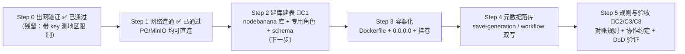

# 方案完善清单（差距分析）

> 调研日期：2026-08-05 ｜ 性质：对 01-04 文档形成的方案做评审，列出「已修正的错误、未验证的假设、缺失的设计」
> 用法：作为进入实施前的 checklist；标 🔴 的项会阻塞 Phase 1，🟡 阻塞 Phase 2，🟢 可延后

---

## A. 评审中已修正/需修正的方案表述

| # | 问题 | 修正结论 | 优先级 |
|---|---|---|---|
| A1 | 「Teable 连接同一 PG 看素材表」被当成理所当然 | Teable 接管已有库表靠 **Database Table（Beta）** 功能（官方文档确认支持 PostgreSQL，但处于 Beta，社区有缺陷报告）；成熟路线是 **NocoDB 连接外部 PG 数据源**（其原生场景）或 Directus。结论：界面层首选实测 Teable Database Table，不行则 NocoDB | 🟢 Phase 3 |
| A2 | Teable AI Agent 能力 | 已核实为 Enterprise 许可（04 文档已写入）；AI 对话查询默认自建（pgvector + MCP），不依赖 Teable AI | 已定 |
| A3 | WeKnora 版本 | NAS 上镜像为 `latest`（约 2 周前构建，即 2026-07 下旬版本），API 全部需要鉴权（/health 公开，/api/v1/* 401）——灌库前必须先建租户和 API key | 🟡 |

## B. 未验证的关键假设（实施前必须实测）

| # | 假设 | 验证方式 | 优先级 |
|---|---|---|---|
| **B1** | **node-banana 容器能访问外网 AI API（Gemini 必需）** | ~~起一次性容器 curl 验证~~ | ✅ **2026-08-05 已验证通过**：一次性容器实测 baidu 200（0.18s）、`generativelanguage.googleapis.com` 0.9s 返回 403（缺 key 的鉴权响应，说明到 Google 链路直连可达，**无需代理**）、fal.ai 429（限流但可达）。残留事项：带团队 Gemini key 实测一次，排除地区限制（user location not supported） |
| B2 | 跨 compose 加入 `weknora_WeKnora-network` 后可用容器名直连 PG | ~~起一次性容器 pg_isready~~ | ✅ **已验证通过**：`WeKnora-postgres` 与 `postgres` 两个名字均 `accepting connections`；`minio` DNS 正常解析（172.19.0.4） |
| B3 | MinIO root 凭据与新建独立 bucket | ~~查 compose 环境变量~~ | ✅ **已验证通过**：root 凭据在容器环境变量中（非 .env 的 ACCESS_KEY，故早前被拒）；root 登录 `mc ls` 成功，现有 bucket 仅 `wyai`（0B 空桶）。新建 `nodebanana-media` 桶无阻碍 |
| B4 | WeKnora 灌库数据形态：「提示词+生成记录」如何组织成 knowledge item（文本模板？JSON？附件关联？）需要端到端 PoC | 建测试知识库 → API 写入 3 条生成记录 → 语义检索命中验证 | 🟡 Phase 2 第 0 步 |
| B5 | ParadeDB 共享实例在 WeKnora 重建索引时的负载窗口（5.6GB 库） | 观察/询问使用规律；embedding 批量写入避开 | 🟡 |

## C. 缺失的设计（文档里还没有的）

| # | 缺什么 | 要点 | 优先级 |
|---|---|---|---|
| ~~**C1**~~ ✅ | **数据库 schema 设计** | 已落地：`workflows / generations / prompts` 三表 + pg_trgm 索引，`embedding vector(768)` 预留（见 `deploy/schema.sql`，2026-08-05 已建库） | ~~🔴~~ 完成 |
| ~~**C2**~~ ✅ | **文件 ↔ DB 一致性策略** | 规则已定稿（删文件不删 DB 记录，DB 留作溯源；对账 SQL 见 06 手册第七节） | ~~🔴~~ 完成（规则层） |
| ~~**C3**~~ ✅ | **多人协作冲突模型** | 协作约定已定稿：按人分目录 + 命名前缀 + 不同时改同一工作流（见 06 手册第六节） | ~~🔴~~ 完成（规则层） |
| C4 | localStorage → 服务端配置的迁移清单 | 共享项（API Key、节点默认值、Provider 设置）→ 服务端；个人项（画布偏好、最近模型）→ 留 localStorage。FTUX 流程要避免每人重填 Key | 🟡 |
| C5 | 历史数据迁移 | 现有 `outputs/`、散落各目录的 workflow JSON、浏览器里导出的文件，需要一个一次性入库脚本（解析 JSON → 写 workflows 表 + 关联媒体） | 🟡 |
| C6 | 备份具体化 | 备份脚本与目录已定（06 手册第五节），**剩余**：fnOS 计划任务配置 + 恢复演练 | 🟡 部分完成 |
| C7 | 访问入口与安全 | 已确认仅 Tailscale 内网可达（无公网映射），风险暂缓；如需加 basic auth 可复用 aiutu-gateway | 🟡 暂缓（有依据） |
| ~~C8~~ ✅ P1 | 各 Phase 验收标准（DoD） | **P1 已达标**（2026-08-05 实测：容器起 ✅ 出网通 ✅ 生成记录入库可查 ✅）；P2/P3 未开始 | 🟡 P1 完成 |

## D. 已有但未利用的 NAS 资产（可纳入后续阶段）

- **视频工具栈**（cobalt/douyin-api/parse-video/video-downloader/streamcap）：未来「选题素材自动入库」管线可直接调用，不必自建下载器；
- **RSS 选题栈**（FreshRSS/RSSHub/we-mp-rss）：选题 → 提示词 → 生成的全链路数据可以汇入同一 PG；
- **Neo4j**：提示词↔素材↔选题↔工作流的图谱关系，WeKnora 图谱已验证可用；
- **navi-proxy / aiutu-gateway**：统一入口与 API 路由的现成件。

## E. 完善后的 Phase 1 任务单（含验证顺序）

**一句话**：方案骨架（复用 ParadeDB + WeKnora + MinIO）已评审成立，且三项关键环境验证（出网、PG/MinIO 连通、MinIO 凭据）已全部实测通过——剩余工作收敛为：**schema 设计（C1）、文件/DB 一致性规则（C2）、多人协作约定（C3）、备份与验收标准（C6-C8）**，下一步即可进入 Step 2 建库建表。
