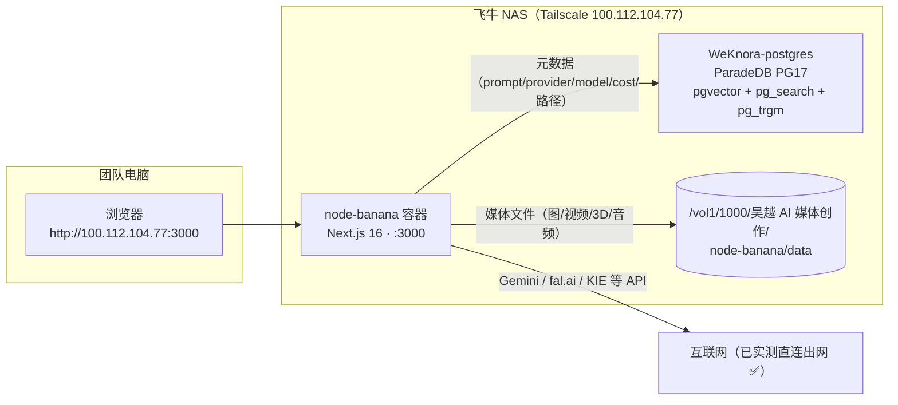

# 06 · node-banana 飞牛 NAS 部署运维手册

> 部署完成日期：2026-08-05 ｜ 状态：✅ 已上线并通过端到端验证
> 服务对象：「吴越 AI」自媒体团队（≤5 人，内网共用，无账号体系）

---

## 一、部署架构（已落地）



关键事实：

| 项目 | 值 |
|---|---|
| 访问地址 | `http://100.112.104.77:3000`（Tailscale 内网） |
| 代码位置（NAS） | `/home/wyai/node-banana/` |
| compose 文件 | `/home/wyai/node-banana/deploy/docker-compose.yml` |
| 环境变量 | `/home/wyai/node-banana/deploy/.env`（权限 600，含 DB 密码，**勿外泄勿提交**） |
| 数据库 | ParadeDB 实例内独立库 `nodebanana`，专用角色 `nodebanana`（不碰 weknora 库） |
| 数据卷 | `/vol1/1000/吴越 AI 媒体创作/node-banana/data` → 容器内 `/data` |
| 网络 | 同时加入 `weknora_WeKnora-network`（解析 `postgres`）+ `deploy_default`（出网） |
| 重启策略 | `restart: unless-stopped`，NAS 重启后自动拉起 |

## 二、已验证清单（2026-08-05 实测）

| 验证项 | 结果 |
|---|---|
| 首页 HTTP 状态 | ✅ 200 |
| `/api/db/health` | ✅ `{"enabled":true,"ok":true}` |
| 保存生成图 → 文件落卷 | ✅ `/vol1/.../data/test/*.png` 可见（测试后已清理） |
| 保存生成图 → `generations` 表入库 | ✅ media_type/provider/model/cost/prompt 全部正确 |
| 保存工作流 → `workflows` 表 upsert | ✅ name/file_path/content 正确 |
| 容器日志 DB 错误 | ✅ 0 条 |
| Gemini API 出网（无 key 403=网络通） | ✅ 部署前一次性容器实测 |

## 三、数据库结构

三张表（`deploy/schema.sql`，可重复执行）：

- `workflows`：画布工作流快照（`file_path` 唯一键 upsert，content 为完整 JSON，预留 `tags`/`created_by`）
- `generations`：生成素材元数据（media_type/prompt/provider/model/cost/file_path/content_hash/is_duplicate，prompt 上有 pg_trgm 模糊索引，预留 `embedding vector(768)` 供 Phase 2 语义检索）
- `prompts`：精选提示词库（可从 generations 提升，预留 embedding）

媒体二进制只存文件卷，DB 只存路径与元数据（C2 原则：文件是载体、DB 是索引）。

## 四、日常运维

SSH 入口：`ssh -i ~/.ssh/fnos_nas_key wyai@100.112.104.77`

```bash
# 查看状态 / 日志
docker ps --filter name=node-banana
docker logs -f node-banana

# 启停
cd /home/wyai/node-banana/deploy
docker compose stop          # 停
docker compose up -d         # 起

# 代码更新（本地改完后）
rsync -az --delete --exclude node_modules --exclude .next --exclude .git \
  --exclude outputs --exclude '.env*' --exclude 'deploy/.env*' \
  -e "ssh -i ~/.ssh/fnos_nas_key" \
  /Users/wuzhu/orca/node-banana/ wyai@100.112.104.77:/home/wyai/node-banana/
ssh -i ~/.ssh/fnos_nas_key wyai@100.112.104.77 \
  'cd /home/wyai/node-banana/deploy && docker compose up -d --build'

# 查库（元数据浏览，临时用 psql；Phase 3 再考虑 Teable/NocoDB 界面）
DBPW=$(grep '^DB_PASSWORD=' /home/wyai/weknora/.env | cut -d= -f2-)
docker exec -e PGPASSWORD="$DBPW" WeKnora-postgres \
  psql -U weknora -d nodebanana -c \
  "SELECT created_at, media_type, provider, model, left(prompt,40) FROM generations ORDER BY created_at DESC LIMIT 20;"
```

## 五、备份（C6 落地）

建议用 fnOS 计划任务（或手动）执行，备份到 `/vol1/1000/backup/node-banana/`：

```bash
mkdir -p /vol1/1000/backup/node-banana
DBPW=$(grep '^DB_PASSWORD=' /home/wyai/weknora/.env | cut -d= -f2-)
docker exec -e PGPASSWORD="$DBPW" WeKnora-postgres \
  pg_dump -U weknora -d nodebanana -Fc \
  > "/vol1/1000/backup/node-banana/nodebanana-$(date +%Y%m%d).dump"
# 媒体卷用 fnOS 快照即可（/vol1/1000/吴越 AI 媒体创作/node-banana/data）
```

保留策略建议：每日一份、保留 7 份（fnOS 计划任务里配）。恢复演练尚未做过——第一次真正依赖数据前建议演练一次 `pg_restore`。

## 六、团队协作约定（C3 规则先行）

应用本身无账号体系，靠约定避免互相踩踏：

1. **按人分目录**：每人在 Project Settings 里把项目目录设为自己的子目录，如 `/data/成员A/项目X`。工作流文件按目录天然隔离。
2. **命名前缀**：工作流文件名加姓名前缀（如 `阿哲-产品图流水线`），一眼可辨归属。
3. **不同时改同一工作流**：两人同时保存同一 `.json` 会后写覆盖前写（DB 里 `workflows` 表同样按 file_path upsert 覆盖）。要借鉴别人的工作流请「另存为」自己的目录。
4. **API Key 共用边界**：Gemini/fal/KIE 等 Key 在 UI 的 Project Settings 里配置，存在浏览器 localStorage——谁配的在谁的浏览器里；建议团队统一一份 Key 清单由负责人保管。

## 七、文件 ↔ DB 一致性规则（C2 落地）

- 文件被移动/删除后，`generations.file_path` 会失效——这是已知取舍。
- 对账 SQL（手动或计划任务跑）：

```sql
-- 找出 DB 里有、但文件系统里已不存在的记录（路径需替换为宿主机视角核对）
SELECT id, file_path FROM generations ORDER BY created_at DESC;
```

- 删除传播规则：**删文件不删 DB 记录**（记录留作成本/提示词溯源）；清理 DB 记录由负责人定期手动执行。

## 八、已知遗留（下次迭代）

| 项 | 状态 | 说明 |
|---|---|---|
| C7 访问安全 | ⚠️ 待评估 | 应用零鉴权，目前仅限 Tailscale 内网可达（未映射公网）。若团队成员都在 Tailscale 内，风险可接受；如需更严可在 aiutu-gateway nginx 加 basic auth |
| Gemini 地区限制 | ⚠️ 待首测 | 网络层已通（403=缺 key），团队首次在 UI 配置真实 Key 后需确认该地区可用 |
| Phase 2 语义检索 | 未开始 | `embedding vector(768)` 字段已预留，需要接 embedding 模型回填 + HNSW 索引 |
| Phase 3 可视化界面 | 未开始 | Teable/NocoDB 界面层评估过，当前用 psql 查库即可满足，数据积累后再上 |
| 68 个本地 vitest 失败 | 与本部署无关 | Node 25 实验性 localStorage 与 jsdom 冲突导致的存量失败（store 层测试），未影响构建与部署 |

## 九、本次部署改动的代码（相对 i18n 提交）

新增：`src/lib/db.ts`、`src/app/api/db/health/route.ts`、`deploy/`（schema.sql / Dockerfile / docker-compose.yml / .env.example）、`.dockerignore`

修改：`server.js`（HOSTNAME 环境变量）、`save-generation` 与 `workflow` 路由（成功后写库）、4 个执行器（请求体补 provider/model/cost）、`CostDialog/ControlPanel/LLMFallbackPopover/ProjectSetupModal/FTUXApiKeysStep/WorkflowCanvas`（补齐用户未提交 deepseek 改动的类型缺口 + 一个事件类型放宽，否则 `next build` 无法通过）
